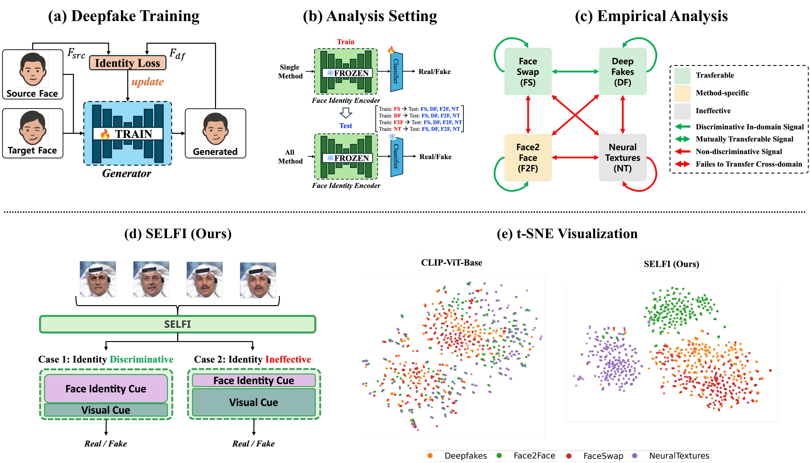
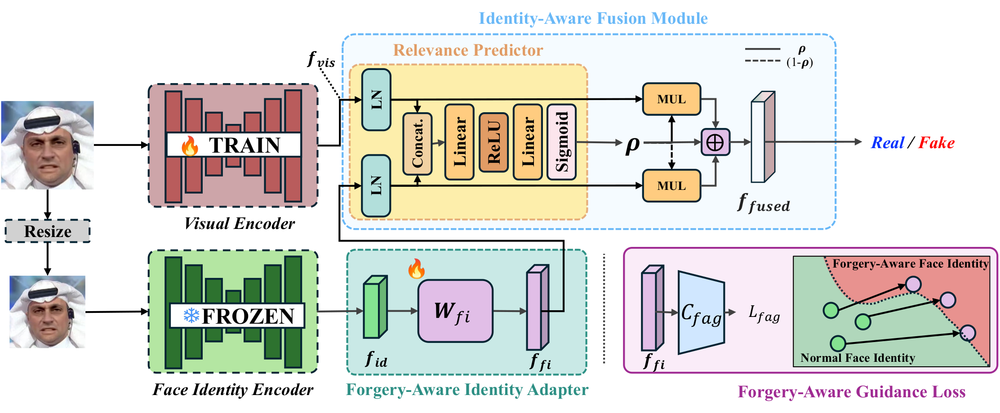

# SELFI: Selective Fusion of Identity for Generalizable Deepfake Detection

[](https://creativecommons.org/licenses/by-nc/4.0/)  

<b>Authors:</b> Younghun Kim, Minsuk Jang, Myung-Joon Kwon, Wonjun Lee, Changick Kim

[[paper](https://arxiv.org/abs/2506.17592)]

---

## 📖 Overview

**SELFI** (*Selective Fusion of Identity*) is a generalizable deepfake detector that adaptively
leverages facial **identity** information instead of treating it as a nuisance to be removed.
While facial identity is often discarded in deepfake detection to avoid overfitting to specific
subjects, we find that identity cues can be highly discriminative when used *selectively*.

SELFI consists of two key components:

1. **A CLIP ViT-B/16 visual backbone** that extracts general forgery-related features.
2. **An Identity-Aware Fusion Module (IAFM)** that projects an identity embedding from a
   pretrained face recognizer (ArcFace, `iresnet100`) and fuses it with the visual feature
   through a learned **relevance score**. This selective, relevance-weighted fusion lets the
   model rely on identity only when it helps, improving cross-dataset generalization.

This codebase is built on top of the excellent
[DeepfakeBench](https://github.com/SCLBD/DeepfakeBench) framework, reusing its unified data
management, training, and evaluation pipeline. See [Acknowledgement](#-acknowledgement).

- Detector implementation: [`training/detectors/selfi_detector.py`](./training/detectors/selfi_detector.py)
- Identity branch (ArcFace iresnet100): [`training/networks/selfi_iresnet.py`](./training/networks/selfi_iresnet.py)
- Config: [`training/config/detector_selfi/SELFI_clip.yaml`](./training/config/detector_selfi/SELFI_clip.yaml)

---

## 🏛️ Architecture

<div align="center">
  
  <br>
  <em>Figure 1. Motivation. Facial identity is not always a nuisance: depending on the forgery,
  identity cues can be discriminative or ineffective. SELFI selectively leverages identity, yielding
  better-separated features than a CLIP-only baseline (t-SNE).</em>
</div>

<br>

<div align="center">
  
  <br>
  <em>Figure 2. SELFI architecture. A visual encoder and a frozen face-identity encoder feed the
  Identity-Aware Fusion Module (IAFM), where a relevance predictor adaptively fuses the visual cue
  and the forgery-aware identity feature for the final real/fake decision.</em>
</div>

---

## 📑 Table of Contents
- [Installation](#1-installation)
- [Download Data](#2-download-data)
- [Download Pretrained Weights](#3-download-pretrained-weights)
- [Training](#4-training)
- [Evaluation](#5-evaluation)
- [Acknowledgement](#-acknowledgement)
- [Citation](#-citation)
- [License](#-license)

---

## ⏳ Quick Start

### 1. Installation

```bash
git clone https://github.com/dudgjs0915/SELFI-Selective-Fusion-of-Identity-for-Generalizable-Deepfake-Detection.git
cd SELFI-Selective-Fusion-of-Identity-for-Generalizable-Deepfake-Detection
conda create -n selfi python=3.7.2
conda activate selfi
sh install.sh
```

Alternatively, you can build the provided [`Dockerfile`](./Dockerfile) to set up the full
environment:

```bash
docker build -t selfi .
docker run --gpus all -itd -v /path/to/this/repository:/app/ --shm-size 64G selfi
```

### 2. Download Data

SELFI follows the **DeepfakeBench** data protocol. We train on FaceForensics++ (c23) and evaluate
cross-dataset on Celeb-DF-v1/v2, DeepFakeDetection (DFD), DFDC, DFDCP, and FaceShifter.

The preprocessed datasets (cropped faces, landmarks, masks) and the JSON arrangement files are
provided by DeepfakeBench — please download them from the
[DeepfakeBench repository](https://github.com/SCLBD/DeepfakeBench#2-download-data)
(Google Drive / Baidu links) and follow its **rearrangement** step to regenerate the JSON files.

Place the data so that the layout matches the defaults in
[`training/config/train_config.yaml`](./training/config/train_config.yaml) and
[`training/config/test_config.yaml`](./training/config/test_config.yaml):

```
datasets
├── rgb            # extracted frames / faces  (rgb_dir)
│   └── FaceForensics++ / Celeb-DF-v2 / ...
└── lmdb           # optional LMDB format       (lmdb_dir)

preprocessing
└── dataset_json   # per-dataset JSON arrangement files (dataset_json_folder)
    └── FaceForensics++.json, Celeb-DF-v2.json, ...
```

If you store the data elsewhere, update `rgb_dir`, `lmdb_dir`, and `dataset_json_folder` in the
two config files above.

### 3. Download Pretrained Weights

Put all model weights into [`./training/pretrained/`](./training/pretrained/).

| File | Source | Needed for |
|------|--------|------------|
| `ms1mv3_arcface_r100_fp16.pth` | [InsightFace model zoo](https://github.com/deepinsight/insightface/tree/master/recognition/arcface_torch) (ArcFace, **MS1MV3**, R100) | **Required** — the IAFM identity branch |
| `xception-b5690688.pth`, `efficientnet-b4-6ed6700e.pth` | [DeepfakeBench `pretrained.zip`](https://github.com/SCLBD/DeepfakeBench/releases/download/v1.0.0/pretrained.zip) (ImageNet backbones) | Only for the Xception / EfficientNet-B4 backbone variants |
| CLIP ViT-B/16 (`openai/clip-vit-base-patch16`) | Auto-downloaded from HuggingFace on first run | The default CLIP backbone — **no manual step needed** |

> The default SELFI configuration uses the **CLIP** backbone, so only
> `ms1mv3_arcface_r100_fp16.pth` is strictly required; CLIP weights are fetched automatically.

**Trained SELFI checkpoint.** Our trained SELFI model weights (CLIP backbone) are available here:

- 📦 **Google Drive:** [SELFI (CLIP backbone) checkpoint](https://drive.google.com/file/d/18sqiL693IeNRpX1xz4YggCUAcynitxpE/view?usp=drive_link)

You can download it directly with [`gdown`](https://github.com/wkentaro/gdown):

```bash
mkdir -p ./training/weights
gdown 18sqiL693IeNRpX1xz4YggCUAcynitxpE -O ./training/weights/selfi_clip_best.pth
```

Place the checkpoint under [`./training/weights/`](./training/weights/) and pass it via
`--weights_path` for evaluation (see below).

### 4. Training

Using the helper script (training + automatic cross-dataset testing):

```bash
bash run_training.sh training/config/detector_selfi/SELFI_clip.yaml 0 "SELFI" "./preprocessing/dataset_json"
```

Or call the training entry point directly:

```bash
python training/train.py \
  --detector_path ./training/config/detector_selfi/SELFI_clip.yaml \
  --train_dataset "FaceForensics++" \
  --test_dataset "Celeb-DF-v1" "Celeb-DF-v2"
```

Training options (datasets, epochs, batch size, fusion settings, loss weights) can be adjusted in
[`training/config/detector_selfi/SELFI_clip.yaml`](./training/config/detector_selfi/SELFI_clip.yaml).
For multi-GPU (DDP) training, see [`train.sh`](./train.sh).

### 5. Evaluation

Evaluate a trained SELFI checkpoint with cross-dataset testing:

```bash
python training/test.py \
  --detector_path ./training/config/detector_selfi/SELFI_clip.yaml \
  --weights_path ./training/weights/selfi_clip_best.pth \
  --test_dataset "FaceForensics++" "Celeb-DF-v2" "Celeb-DF-v1" "DeepFakeDetection" "DFDC" "DFDCP" "FaceShifter"
```

The evaluation metric is the frame-level AUC, consistent with the DeepfakeBench protocol.

---

## 🙏 Acknowledgement

This project is built on top of
[**DeepfakeBench**](https://github.com/SCLBD/DeepfakeBench) (Yan *et al.*, NeurIPS 2023 Datasets &
Benchmarks). We received tremendous help from their codebase — our data management, training loop,
and evaluation protocol all reuse the DeepfakeBench framework. We sincerely thank the DeepfakeBench
authors for open-sourcing such a clean and comprehensive benchmark.

We also thank the [InsightFace](https://github.com/deepinsight/insightface) and
[CLIP](https://github.com/openai/CLIP) projects for their pretrained models.

---

## 📝 Citation

If you find SELFI useful for your research, please cite our work:

```bibtex
@article{kim2025selfi,
  title={SELFI: Selective Fusion of Identity for Generalizable Deepfake Detection},
  author={Kim, Younghun and Jang, Minsuk and Kwon, Myung-Joon and Lee, Wonjun and Kim, Changick},
  journal={arXiv preprint arXiv:2506.17592},
  year={2025}
}

@inproceedings{kim2024friday,
  title={Friday: Mitigating unintentional facial identity in deepfake detectors guided by facial recognizers},
  author={Kim, Younghun and Kwon, Myung-Joon and Lee, Wonjun and Kim, Changick},
  booktitle={2024 IEEE International Conference on Visual Communications and Image Processing (VCIP)},
  pages={1--5},
  year={2024},
  organization={IEEE}
}
```

Please also consider citing DeepfakeBench, on which this codebase is built:

```bibtex
@inproceedings{DeepfakeBench_YAN_NEURIPS2023,
  author = {Yan, Zhiyuan and Zhang, Yong and Yuan, Xinhang and Lyu, Siwei and Wu, Baoyuan},
  booktitle = {Advances in Neural Information Processing Systems},
  title = {DeepfakeBench: A Comprehensive Benchmark of Deepfake Detection},
  volume = {36},
  year = {2023}
}
```

---

## 🛡️ License

This repository inherits the license of DeepfakeBench and is released under the
Creative Commons Attribution-NonCommercial 4.0 International Public License
([CC BY-NC-4.0](https://creativecommons.org/licenses/by-nc/4.0/)). See [LICENSE](./LICENSE) for
details.
